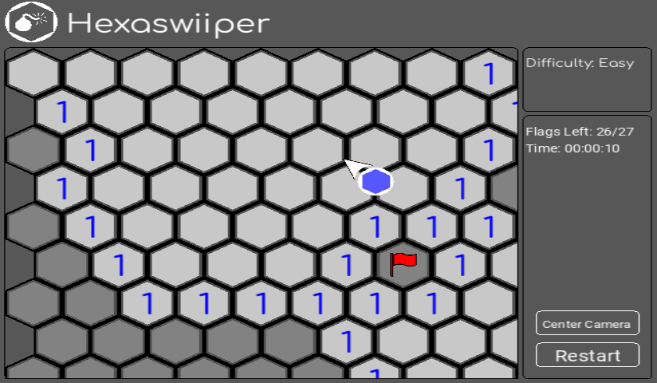
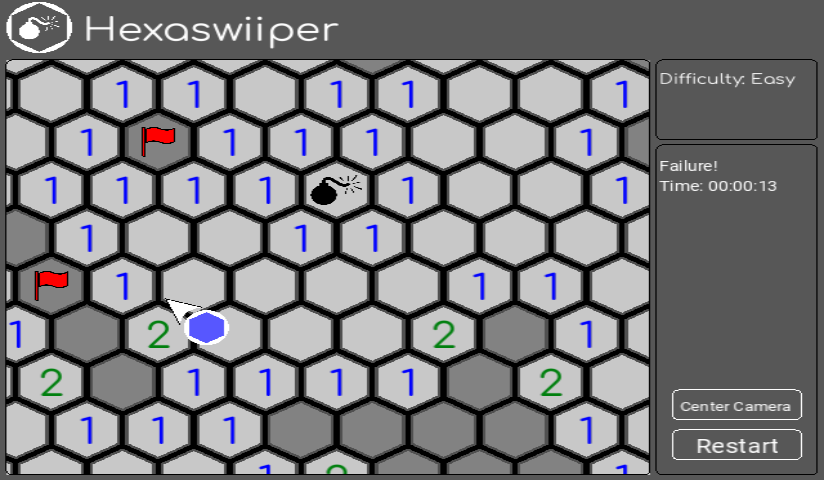

# Hexaswiiper

Hexaswiiper is a basic minesweeper clone with an hexagonal board for the Wii.

## Images

 

## Usage Instructions

Hexasweeeper can be ran with physical hardware or emulation. You can grab the hexaswiiper.dol file from the releases tab. 